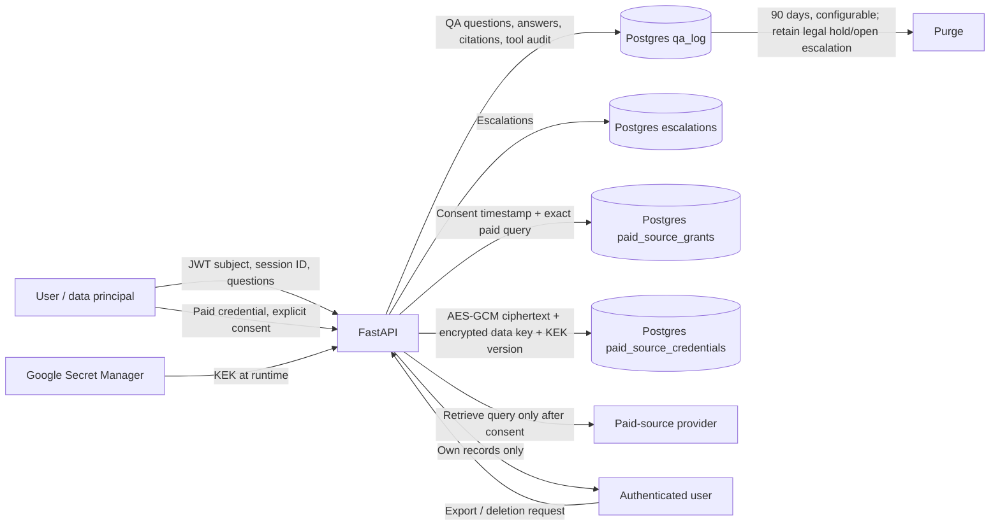

# Personal-data flow and retention

## Data inventory and access

| Data | Storage | Access | Retention |
| --- | --- | --- | --- |
| JWT subject, session ID, questions, answers, citations, tool audit | `qa_log` | Application runtime; the authenticated data principal through `/privacy/export`; authorized database operators | `QA_RETENTION_DAYS` (90 by default). Automatically purged unless `legal_hold` is set or the session has an open escalation. |
| Escalation question and status | `escalations` | Application runtime, authorized support/review staff, data principal export | Until data-principal deletion, unless a separate legal retention obligation applies. |
| Paid-provider consent and exact query with timestamp | `paid_source_grants.consent_log_json` | Application runtime, authorized audit staff, data principal export | Until data-principal deletion or an applicable legal hold. |
| Paid-provider credential | `paid_source_credentials` | Encryption service path only; never returned by export or logs | Until data-principal deletion or credential rotation. Stored only as ciphertext, encrypted data key, nonces, and KEK version. |

The paid provider receives only the user-approved query. Google Secret Manager is accessed only by the workload identity to obtain the KEK; no application user can retrieve it. `/privacy/export` and `/privacy/data` require a JWT and operate strictly on its `sub` claim. Deletion physically removes eligible rows; legal-hold QA rows are retained and reported by the lower deletion count.
